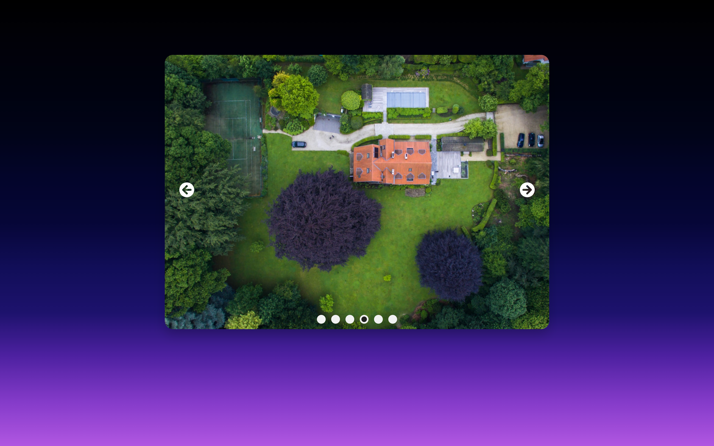

<h1 align="center"> React Carousel</h1>

<h3 align="center">React Carousel built with React.js and pure CSS for learning and practicing purposes.</h3>

---

### Prerequisite :hammer_and_wrench:

Make sure you have these installed

- [Node.js](https://nodejs.org/en/)
- [git](https://git-scm.com/)

### Instructions :gear:

1. Clone this repository into your local machine using the terminal (mac) or Gitbash (PC) `git clone https://github.com/ahmdabdelsamea/react-carousel.git`
2. CD to the folder `cd react-carousel`
3. Run `npm install` to install the project dependencies
4. Run `npm start` to run the project at http://localhost:3000

### Technologies :rocket:

- [React](https://reactjs.org/)
- [react-icons](https://react-icons.github.io/react-icons/)
- [uuid](https://github.com/uuidjs/uuid)

> Made with :heart: by Ahmed Abdelsamea _aka BNA_
